# 🚀 Orbital Rocket Simulation

A realistic 2D physics simulation of orbital mechanics and rocket launches from Earth. Experience the challenge of launching a Falcon 9-like rocket into orbit with accurate physics, atmospheric modeling, and an intelligent closed-loop guidance system.

**🌐 Live Demo: [https://www.donutthejedi.com/](https://www.donutthejedi.com/)**


## 📋 Table of Contents

- [Features](#-features)
- [Getting Started](#-getting-started)
- [Game Modes](#-game-modes)
- [Controls](#-controls)
- [Technical Details](#-technical-details)
- [Guidance System](#-guidance-system)
- [Project Structure](#-project-structure)
- [Contributing](#-contributing)

## ✨ Features

### Physics & Simulation
- **Realistic Orbital Mechanics**: Full 2-body problem with accurate vis-viva equations
- **US Standard Atmosphere 1976**: Piecewise atmospheric model with geopotential altitude corrections
- **Variable Thrust**: Sea-level to vacuum thrust and ISP variation
- **Atmospheric Drag**: Velocity-relative drag calculations accounting for Earth's rotation
- **Symplectic Euler Integration**: Energy-conserving numerical integration for stable orbits
- **Adaptive Sub-stepping**: Variable timestep for accuracy in different flight phases

### Game Modes
- **Manual Control**: Take full control of pitch with W/S keys while receiving guidance recommendations
- **Guided Launch**: Set a target altitude and let the intelligent guidance system handle the launch
- **Orbital Mode**: Spawn directly in orbit to practice orbital maneuvers and burns

### Guidance System
- **Closed-Loop Guidance**: Priority-based system that adapts to flight conditions
- **Max-Q Protection**: Automatic structural limit protection during atmospheric flight
- **Orbit Shaping**: Intelligent apoapsis/periapsis management for precise orbit insertion
- **Multiple Strategies**: Direct ascent and traditional circularization approaches

### User Interface
- **Real-Time Telemetry**: Altitude, velocity, orbital parameters, and more
- **Mission Events**: Timeline of important mission milestones
- **Orbital Visualization**: Real-time orbit prediction and visualization
- **Time Warp**: Speed up simulation up to 1000x
- **Camera Controls**: Follow rocket or center on Earth

## 🚀 Getting Started

### Prerequisites
- A modern web browser (Chrome, Firefox, Edge, Safari)
- No installation required - runs entirely in the browser!

### Running the Simulation

1. **Clone or download** this repository
2. **Open `index.html`** in your web browser
3. **Click the MENU button** to select a game mode
4. **Start your mission!**

### Quick Start Guide

1. **Select a Mode**:
   - **Manual Control**: For hands-on experience
   - **Guided Launch**: For automated launches (set target altitude)
   - **Orbital Mode**: For practicing orbital mechanics

2. **Launch** (Manual/Guided modes):
   - Click the **LAUNCH** button
   - Watch the telemetry and follow mission events

3. **Orbital Maneuvers** (Orbital mode):
   - Use the burn controls to perform prograde, retrograde, normal, anti-normal, radial, and anti-radial burns
   - Hold buttons to burn, release to stop

## 🎮 Game Modes

### Manual Control Mode
Take full control of your rocket's pitch angle while receiving real-time guidance recommendations.

- **Pitch Control**: W/S keys or on-screen buttons
- **Guidance Recommendations**: See what the guidance system suggests (displayed in cyan)
- **Learning Tool**: Compare your decisions with optimal guidance
- **Rate Limited**: Realistic 2°/s pitch rate limit

### Guided Launch Mode
Set a target altitude and let the intelligent guidance system handle the entire launch sequence.

- **Configurable Target**: Set any altitude from 150km to 2000km (default: 500km)
- **Automatic Guidance**: Handles atmospheric ascent, orbit insertion, and circularization
- **Adaptive Strategy**: Chooses direct ascent or traditional circularization based on target
- **Precision**: Achieves orbit within ±5km tolerance

### Orbital Mode
Spawn directly in orbit to practice orbital mechanics without going through launch.

- **Altitude Selection**: Choose from presets (200km, 400km, 500km, 600km, 800km)
- **10% Fuel**: Realistic fuel constraint for practice
- **Orbital Burns**: Full access to all burn directions
- **No Launch Events**: Clean orbital environment

## 🎯 Controls

### General Controls
| Action | Control |
|--------|---------|
| Open Menu | **MENU** button |
| Launch | **LAUNCH** button (Manual/Guided modes) |
| Pause/Resume | **PAUSE** button |
| Reset Mission | **RESET** button (restarts current mode) |
| Time Warp | **SPEED** button (cycles: 1x, 2x, 5x, 10x, 25x, 50x, 100x, 500x, 1000x) |
| Zoom Out | **ZOOM OUT** button or mouse wheel |
| Zoom In | **ZOOM IN** button or mouse wheel |
| Auto Zoom | **AUTO ZOOM** button (toggle) |
| Camera Mode | **FOLLOW ROCKET** / **CENTER EARTH** button |

### Manual Control Mode
| Action | Control |
|--------|---------|
| Pitch Up | **W** key or **↑ PITCH UP** button |
| Pitch Down | **S** key or **↓ PITCH DOWN** button |
| Throttle Up | **↑** arrow key |
| Throttle Down | **↓** arrow key |

### Orbital Mode
| Action | Control |
|--------|---------|
| Prograde Burn | **PROGRADE** button (hold) |
| Retrograde Burn | **RETROGRADE** button (hold) |
| Normal Burn | **NORMAL** button (hold) |
| Anti-Normal Burn | **ANTI-NORMAL** button (hold) |
| Radial Burn | **RADIAL** button (hold) |
| Anti-Radial Burn | **ANTI-RADIAL** button (hold) |
| Refuel | **REFUEL** button (+5000 kg) |

## 🔬 Technical Details

### Physics Model

#### Atmospheric Model
- **US Standard Atmosphere 1976**: Industry-standard atmospheric model
- **7 Atmospheric Layers**: Troposphere, tropopause, stratosphere (I & II), stratopause, mesosphere (I & II)
- **Geopotential Altitude**: Correct conversion from geometric to geopotential altitude
- **Sutherland's Viscosity Law**: Temperature-dependent dynamic viscosity

#### Orbital Mechanics
- **2-Body Problem**: Earth-centered gravitational model
- **Vis-Viva Equation**: Accurate orbital velocity calculations
- **Kepler's Equation**: Eccentric anomaly calculations for time predictions
- **Orbital Elements**: Apoapsis, periapsis, semi-major axis, eccentricity

#### Rocket Physics
- **Variable Thrust**: Pressure-adjusted thrust (sea-level to vacuum)
- **Variable ISP**: Specific impulse varies with atmospheric pressure
- **Mass Flow Rate**: Tsiolkovsky rocket equation
- **Drag Model**: Velocity-relative drag with rotating atmosphere

### Rocket Configuration

The simulation uses a **Falcon 9-like** configuration:

**Stage 1**:
- Dry Mass: 22,200 kg
- Propellant: 395,700 kg
- Thrust (SL): 7,607 kN
- Thrust (Vac): 8,227 kN
- ISP (SL): 282 s
- ISP (Vac): 311 s

**Stage 2**:
- Dry Mass: 4,000 kg
- Propellant: 92,670 kg
- Thrust: 981 kN (vacuum)
- ISP: 348 s

**Payload**: 15,000 kg

### Numerical Integration

- **Symplectic Euler**: Energy-conserving integrator for stable long-term orbits
- **Adaptive Sub-stepping**: 
  - 50ms steps during ascent
  - 10ms steps in orbit (for accuracy)
- **Maximum Timestep**: 1.0s cap to prevent numerical instability

## 🧭 Guidance System

The guidance system uses a priority-based approach that adapts to flight conditions:

### Atmospheric Phase (Below 70km)
1. **Height Priority**: Get above 70km (out of significant atmosphere)
2. **Max-Q Protection**: Don't exceed structural limits, follow prograde exactly
3. **Gravity Turn**: Natural pitchover with turn rate limiting
4. **Minimum Vertical Velocity**: Ensure enough vertical velocity at atmosphere exit

### Vacuum Phase (Above 70km)
1. **Apoapsis Management**: Raise apoapsis to target altitude
2. **Periapsis Safety**: Ensure periapsis stays above 100km (safe altitude)
3. **Orbit Shaping**: Adjust flight path angle based on target altitude
4. **Circularization**: Precise burn at apoapsis for circular orbit

### Guidance Cases

| Case | Condition | Action |
|------|-----------|--------|
| **0** | Pe < 0, Ap ≥ target | 🚨 Emergency horizontal burn |
| **1** | Ap < target | 📈 Raise apoapsis with FPA guidance |
| **2a** | Pe < 100km, descending | 🚨 Emergency prograde burn |
| **2b** | Pe < 100km, ascending | ⏳ Coast to Apo, then prograde |
| **3** | Ap > target | ⏳ Coast to Pe, then retrograde |
| **4a** | Pe < target, near Apo | 🔄 Circularize prograde |
| **4b** | Pe < target, far from Apo | ⏳ Coast to apoapsis |
| **5** | Both within tolerance | ✅ Orbit achieved |

### Guidance System Flowchart

```mermaid
flowchart TD
    subgraph INIT["⚡ INITIALIZATION"]
        Start([Guidance Loop]) --> Gather[Gather State<br/>Position, Velocity, Altitude]
        Gather --> Predict[Predict Orbit<br/>Apoapsis, Periapsis, SMA]
    end

    subgraph ATMO["🌍 ATMOSPHERIC PHASE · Alt < 70km"]
        Predict --> AtmoCheck{Alt < 70km?}
        AtmoCheck -->|Yes| TimeCheck{T < 10s?}
        TimeCheck -->|Yes| Vertical["Vertical Ascent<br/>Pitch = 90°"]
        TimeCheck -->|No| KickCheck{T < 13s?}
        KickCheck -->|Yes| PitchKick["Pitch Kick<br/>Initiate gravity turn"]
        KickCheck -->|No| MaxQCheck{Q > 80% MaxQ?}
        MaxQCheck -->|Yes| MaxQ["Max-Q Protection<br/>Follow prograde"]
        MaxQCheck -->|No| AtmoGuidance["Atmospheric Guidance<br/>• Prograde following<br/>• Turn rate limiting<br/>• Min vVertical check"]
    end

    subgraph VACUUM["🌌 VACUUM PHASE · Alt ≥ 70km"]
        AtmoCheck -->|No| CalcFPA["Calculate Target FPA<br/>f(progress, target altitude)"]
        
        CalcFPA --> Case0{Pe < 0 AND<br/>Ap ≥ target?}
        Case0 -->|Yes| Emergency["🚨 CASE 0: EMERGENCY<br/>Burn horizontal, full throttle"]
        
        Case0 -->|No| Case1{Ap < target?}
        Case1 -->|Yes| RaiseApo["📈 CASE 1: RAISE APOAPSIS<br/>Burn with FPA guidance"]
        
        Case1 -->|No| Case2{Pe < 100km?}
        Case2 -->|Yes| DescendCheck{Descending?}
        DescendCheck -->|Yes| EmergencyPe["🚨 CASE 2a: EMERGENCY<br/>Burn prograde NOW"]
        DescendCheck -->|No| CoastToApo["⏳ CASE 2b: COAST TO APO<br/>Then burn prograde"]
        
        Case2 -->|No| Case3{Ap > target?}
        Case3 -->|Yes| CoastToPe["⏳ CASE 3: COAST TO PE<br/>Then retrograde burn"]
        
        Case3 -->|No| Case4{Pe < target?}
        Case4 -->|Yes| CircCheck{Near Apo?}
        CircCheck -->|Yes| Circ["🔄 CASE 4a: CIRCULARIZE<br/>Burn prograde at Apo"]
        CircCheck -->|No| CoastCirc["⏳ CASE 4b: COAST<br/>Wait for apoapsis"]
        
        Case4 -->|No| Achieved["✅ CASE 5: ORBIT ACHIEVED"]
    end

    subgraph OUTPUT["📤 OUTPUT"]
        Vertical & PitchKick & MaxQ & AtmoGuidance --> Constrain
        Emergency & RaiseApo & EmergencyPe --> Constrain
        CoastToApo & CoastToPe & Circ & CoastCirc & Achieved --> Constrain
        
        Constrain["Apply Constraints<br/>Pitch: -5° to 90°<br/>Rate: 2°/s max"] --> Return(["Return Command"])
    end
```



### Key Parameters

- **Atmosphere limit**: 70 km
- **Safe periapsis**: 100 km (above atmosphere with margin)
- **Target orbit**: Configurable (default: 500 km circular)
- **Pitch constraints**: -5° to +90°
- **Max pitch rate**: 2°/s
- **Max Q limit**: 35 kPa (typical Falcon 9 structural limit)

## 📁 Project Structure

```
Rocket/
├── index.html          # Main HTML file
├── README.md          # This file
├── css/
│   └── styles.css     # UI styling
└── js/
    ├── main.js        # Main game loop and menu logic
    ├── state.js       # Game state management
    ├── physics.js     # Atmospheric and physics calculations
    ├── guidance.js    # Closed-loop guidance system
    ├── orbital.js     # Orbital mechanics calculations
    ├── events.js      # Mission event tracking
    ├── input.js       # User input handling
    ├── renderer.js    # Canvas rendering
    ├── telemetry.js   # Telemetry display updates
    └── constants.js   # Physical constants and configuration
```

### Key Files

- **`main.js`**: Game loop, update function, menu system
- **`guidance.js`**: Complete closed-loop guidance implementation (880 lines)
- **`physics.js`**: US Standard Atmosphere 1976 model, drag, thrust calculations
- **`orbital.js`**: Orbit prediction, vis-viva, Kepler's equation
- **`state.js`**: State management, orbital spawn function

## 🎓 Educational Value

This simulation is excellent for:
- **Learning Orbital Mechanics**: Understand how orbits work in practice
- **Rocket Science**: See how thrust, gravity, and drag interact
- **Guidance Systems**: Learn how closed-loop guidance works
- **Atmospheric Physics**: Explore how atmosphere affects flight
- **Mission Planning**: Practice orbital maneuvers and burns

## 🐛 Known Limitations

- **2D Only**: Simplified to 2D plane (no inclination changes)
- **Constant Drag Coefficient**: Real rockets have Mach-dependent drag
- **No Wind/Weather**: Atmospheric conditions are standard only
- **Instant Stage Separation**: Real separations have dynamics
- **No Structural Failure**: Max-Q protection exists but no failure modeling

## 🤝 Contributing

Contributions are welcome! Areas for improvement:
- 3D orbital mechanics
- More realistic drag models
- Additional rocket configurations
- Mission scenarios
- UI/UX improvements

## 📝 License

This project is open source. Feel free to use, modify, and distribute.

## 🙏 Acknowledgments

- **US Standard Atmosphere 1976**: NOAA, NASA, and USAF
- **Falcon 9 Specifications**: Based on publicly available SpaceX data
- **Orbital Mechanics**: Based on classical two-body problem solutions

---

**Enjoy your journey to orbit!** 🚀
